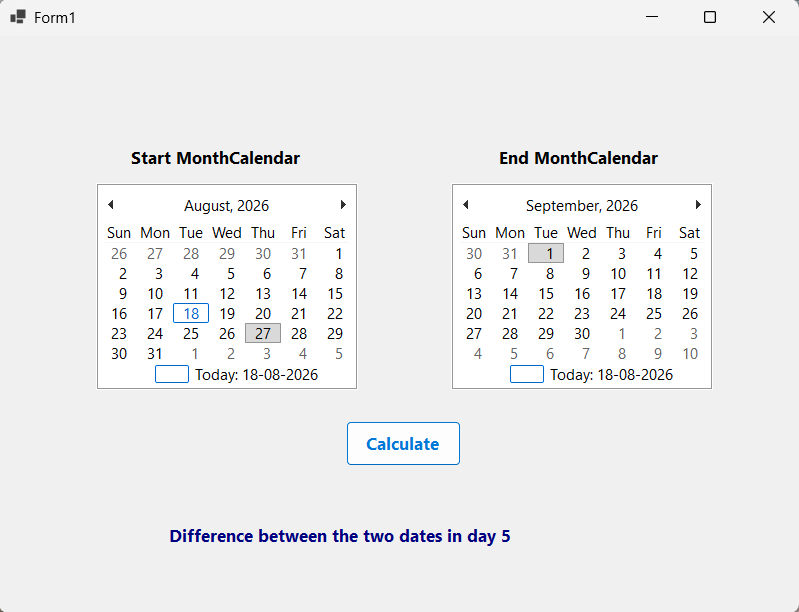

# 📅 Date Difference Calculator

A Windows Forms application that allows the user to select two dates using **MonthCalendar** controls and calculate the difference between them in days.

## 📄 Files

```text
Program.cs
Form1.cs
Form1.Designer.cs
Form1.resx
README.md
Screenshot.png
```

## ✨ Features

* Select a starting date using the first MonthCalendar.
* Select an ending date using the second MonthCalendar.
* Calculate the difference between the two selected dates.
* Use `TimeSpan` to calculate the date difference.
* Use `Math.Abs()` to ensure the result is always positive.
* Display the total difference in days using a Label.
* Provide a simple Windows Forms interface.

## ⚙️ Working

```text
Select First Date
        ↓
Select Second Date
        ↓
Click Calculate Button
        ↓
Calculate Date Difference
        ↓
Get Total Days
        ↓
Display Result in Label
```

## 🖥️ Example Output

```text
Difference between the two dates in day 10
```

## 📚 Concepts Used

* C# Windows Forms
* MonthCalendar
* Button
* Label
* `SelectionStart`
* `SelectionEnd`
* `DateTime`
* `TimeSpan`
* `Math.Abs()`
* Click Event
* Event Handling

## 🎯 Learning Outcome

* Understand how to use the MonthCalendar control.
* Learn how to select and retrieve dates.
* Practice calculating the difference between two dates.
* Understand the use of the `TimeSpan` structure.
* Learn how to use `Math.Abs()` for positive results.
* Practice displaying calculated results dynamically in a Label.

## 📸 Screenshot



---

👨‍💻 **Akash Raval**
