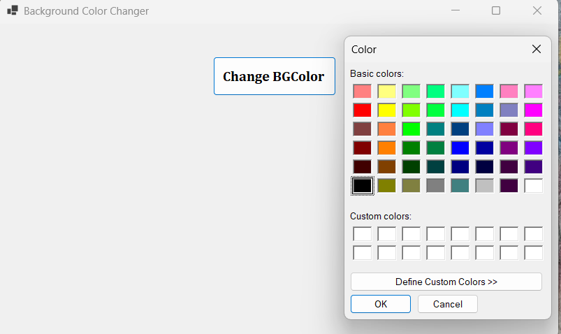

# 🎨 Background Color Changer

A Windows Forms application that allows the user to change the **background color of the form** using the `ColorDialog` control.

## 📄 Files

```text
Program.cs
Form1.cs
Form1.Designer.cs
Form1.resx
README.md
Screenshot.png
```

## ✨ Features

* Open a color selection dialog using `ColorDialog`.
* Select any color from the available color options.
* Change the form's background color dynamically.
* Apply the selected color when the user clicks **OK**.
* Provide a simple and user-friendly Windows Forms interface.

## ⚙️ Working

```text
Click "Change BGColor"
          ↓
Open ColorDialog
          ↓
Select a Color
          ↓
Click OK
          ↓
Change Form Background Color
```

## 🖥️ Example

```text
Background Color Changer

        [ Change BGColor ]

Select a color from ColorDialog
        ↓
Form background changes
```

## 📚 Concepts Used

* C# Windows Forms
* Button
* ColorDialog
* `DialogResult`
* `Color`
* `BackColor` Property
* Click Event
* Conditional Statements
* Event Handling

## 🎯 Learning Outcome

* Understand how to use the `ColorDialog` control.
* Learn how to display a color selection dialog.
* Practice handling `DialogResult`.
* Learn how to change the form's `BackColor` dynamically.
* Understand basic dialog box handling in Windows Forms.

## 📸 Screenshot



---

👨‍💻 **Akash Raval**
