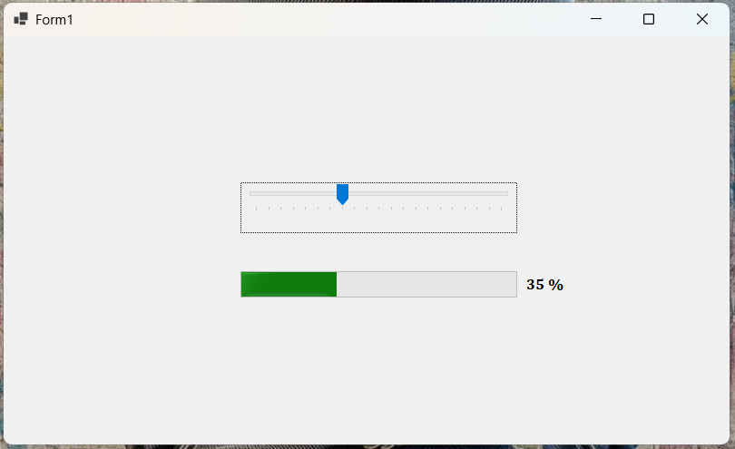

# 🎚️ TrackBar ProgressBar Synchronization

A Windows Forms application that demonstrates how to link a **TrackBar** control with a **ProgressBar**. As the user moves the TrackBar, the ProgressBar updates dynamically according to the current TrackBar value.

## 📄 Files

```text
Program.cs
Form1.cs
Form1.Designer.cs
Form1.resx
README.md
Screenshot.png
```

## ✨ Features

* Control progress using a TrackBar.
* Update the ProgressBar dynamically.
* Display the current progress percentage.
* Synchronize the TrackBar and ProgressBar values.
* Update the interface in real time while sliding the TrackBar.
* Provide a simple Windows Forms interface.

## ⚙️ Working

```text
Move TrackBar
      ↓
TrackBar Scroll Event
      ↓
Get Current TrackBar Value
      ↓
Update ProgressBar Value
      ↓
Display Percentage in Label
```

## 🖥️ Example Output

```text
TrackBar Value: 50

Progress: 50 %
```

## 📚 Concepts Used

* C# Windows Forms
* TrackBar
* ProgressBar
* Label
* `Scroll` Event
* `Value` Property
* Event Handling
* Dynamic UI Updates

## 🎯 Learning Outcome

* Understand how to use the TrackBar control.
* Learn how to use the ProgressBar control.
* Practice handling the `Scroll` event.
* Learn how to synchronize values between two controls.
* Practice updating a Label dynamically.
* Understand real-time UI updates in Windows Forms.

## 📸 Screenshot



---

👨‍💻 **Akash Raval**
