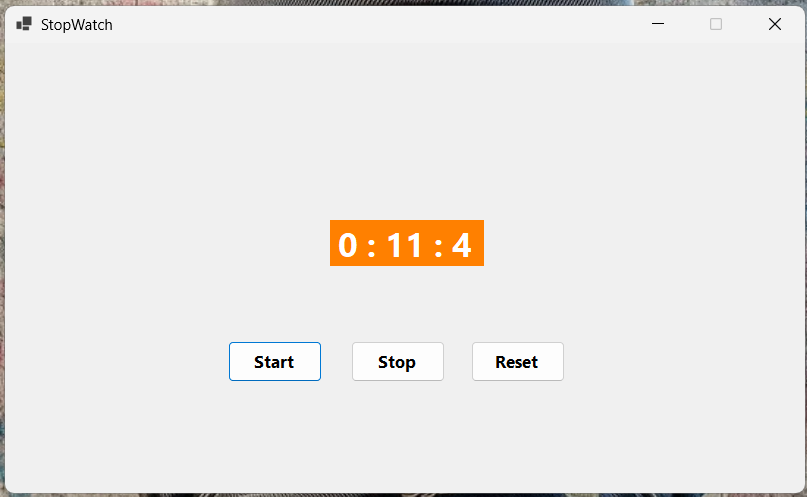

# ⏱️ Stopwatch Application

A Windows Forms application that demonstrates a simple **Stopwatch** using a `Timer` control. The application allows the user to start, stop, and reset the timer while displaying the elapsed time dynamically.

## 📄 Files

```text
Program.cs
Form1.cs
Form1.Designer.cs
Form1.resx
README.md
Screenshot.png
```

## ✨ Features

* Start the stopwatch using the **Start** button.
* Stop the stopwatch using the **Stop** button.
* Reset the stopwatch to its initial value using the **Reset** button.
* Display minutes, seconds, and milliseconds dynamically.
* Update the timer continuously using the `Timer` control.
* Enable or disable controls based on the stopwatch state.
* Provide a simple and user-friendly Windows Forms interface.

## ⚙️ Working

```text
Click Start
     ↓
Enable Timer
     ↓
Timer Tick Event
     ↓
Update Milliseconds
     ↓
Update Seconds and Minutes
     ↓
Display Time in Label
```

## 🖥️ Example Output

```text
0:40:9
```

## 📚 Concepts Used

* C# Windows Forms
* Timer
* Label
* Button
* `Tick` Event
* `Enabled` Property
* Event Handling
* Conditional Statements
* Dynamic UI Updates

## 🎯 Learning Outcome

* Understand how to use the Windows Forms `Timer` control.
* Learn how to handle the `Tick` event.
* Practice starting and stopping a timer.
* Learn how to reset timer values.
* Understand how to update a Label dynamically.
* Practice managing control states using the `Enabled` property.

## 📸 Screenshot



---

👨‍💻 **Akash Raval**
