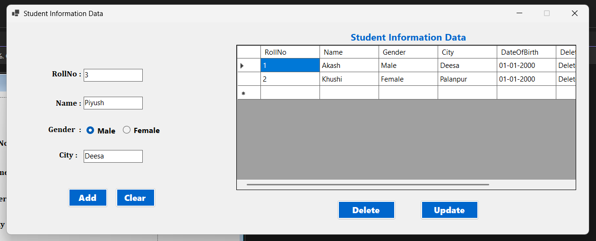

# 🎓 Student Information Database

A **C# Windows Forms** desktop application for managing student information using **SQL Server LocalDB**.

The application provides a graphical interface to add, view, update, and delete student records. Student information is displayed using a `DataGridView`, and existing records can be edited through a dedicated update form.

---

## 📸 Application Preview



---

## 📁 Project Structure

```text
Student-Information-Database-Demo/
│
├── Program.cs                  # Application entry point
├── Form1.cs                    # Main dashboard and database logic
├── Form1.Designer.cs           # Main form UI component definitions
├── Form1.resx                  # Main form resource file
│
├── frmUpdate.cs                # Student update form logic
├── frmUpdate.Designer.cs       # Update form UI component definitions
├── frmUpdate.resx              # Update form resource file
│
├── Screenshot.png              # Application screenshot
└── README.md                   # Project documentation
```

---

## ✨ Features

* Add new student records.
* Enter student Roll Number.
* Enter student Name.
* Select Gender using RadioButtons.

  * Male
  * Female
* Enter student City.
* Display student records using `DataGridView`.
* Delete student records.
* Update existing student information.
* Open a dedicated update form for editing records.
* Validate required input fields.
* Clear input fields.
* Display success, warning, and error messages using `MessageBox`.
* Refresh the `DataGridView` after database operations.
* Connect the Windows Forms application with SQL Server LocalDB.

---

## ⚙️ Application Working

```text
Enter Student Details
        ↓
Select Gender
        ↓
Add Student Record
        ↓
Store Data in Database
        ↓
Display Records in DataGridView
        ↓
Delete / Update Existing Record
        ↓
Refresh DataGridView
```

### 🔄 Update Working

```text
Select Update Action
        ↓
Open Update Student Details Form
        ↓
Load Existing Student Information
        ↓
Edit Name / Gender / City
        ↓
Click Save Changes
        ↓
Execute SQL UPDATE
        ↓
Refresh DataGridView
```

---

## 🧩 Controls Used

* Panel
* Label
* TextBox
* RadioButton
* Button
* DataGridView
* MessageBox

---

## 🗄️ Database

The application uses **SQL Server LocalDB** for storing student information.

### Student Table

```text
tblStudent
│
├── RollNo
├── Name
├── Gender
└── City
```

The application performs database operations using:

* SQL `INSERT`
* SQL `SELECT`
* SQL `UPDATE`
* SQL `DELETE`

---

## 📚 Concepts Used

* C# Windows Forms
* .NET
* SQL Server LocalDB
* Database Connectivity
* CRUD Operations
* `SqlConnection`
* `SqlCommand`
* `SqlDataAdapter`
* `DataTable`
* `DataGridView`
* SQL Queries
* Event Handling
* RadioButton Selection
* Input Validation
* Conditional Statements
* `MessageBox`
* Multiple Windows Forms

---

## 🎯 Learning Outcome

* Understand database connectivity in C# Windows Forms.
* Learn how to connect a Windows Forms application with SQL Server LocalDB.
* Practice complete CRUD operations.
* Learn how to insert and retrieve database records.
* Learn how to update existing student records.
* Learn how to delete student records.
* Practice displaying database data using `DataGridView`.
* Understand how multiple Windows Forms can work together.
* Practice input validation and error handling.
* Improve practical knowledge of C# .NET database programming.

---

## 📸 Screenshot


---

## 👨‍💻 Author

**Akash Raval**

C# / .NET GUI Learning Journey
